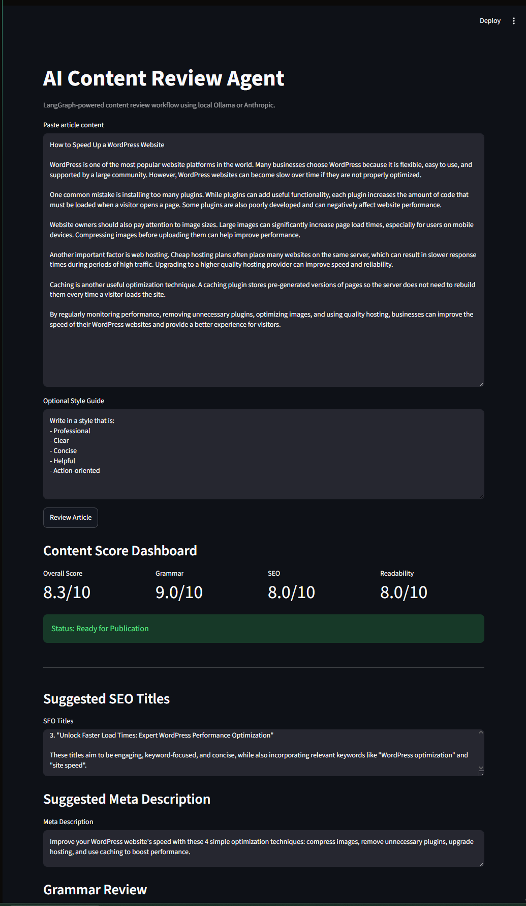

# AI Content Review Agent

A LangGraph-powered AI workflow that reviews content for grammar, SEO, and readability, then generates an improved version ready for publication.

Built as a practical AI automation project to explore workflow orchestration, multi-agent systems, local LLM deployment, and production-oriented AI application design.

---

## Overview

The AI Content Review Agent helps content teams evaluate and improve written content by automatically:

- Reviewing grammar, spelling, and clarity
- Evaluating SEO quality and opportunities
- Analyzing readability and user experience
- Rewriting content using AI recommendations
- Producing structured feedback and scoring

The project is designed to run locally using Ollama for zero API costs, while remaining compatible with Anthropic Claude through environment configuration.

## Why I Built This

I built this project to gain hands-on experience with LangGraph, AI workflow orchestration, and local LLM deployment while exploring how AI can automate content review workflows.

The goal was to create a practical AI system that provides real business value rather than a simple chatbot demonstration.

---

## Screenshots

### Main Interface


### Content Review Dashboard



### Detailed Analysis Results


## Features

- Grammar Review Agent
- SEO Review Agent
- Readability Review Agent
- AI Rewrite Agent
- Executive Content Score Dashboard
- SEO Title Generation
- Meta Description Generation
- Style Guide Guided Rewriting
- Downloadable Review Reports
- Local LLM Support via Ollama
- Cloud LLM Support via Anthropic
- LangGraph Workflow Orchestration

## Architecture

```text
Article Input
      │
      ▼
Grammar Review
      │
      ▼
SEO Review
      │
      ▼
Readability Review
      │
      ▼
SEO Title Generator
      │
      ▼
Meta Description Generator
      │
      ▼
Rewrite Agent
      │
      ▼
Content Dashboard
      │
      ▼
Final Report
```

Built using LangGraph to model a multi-step AI workflow where each node performs a specific content analysis task.

---

## Key Technical Concepts Demonstrated

- Multi-agent workflow orchestration
- LangGraph state management
- Local LLM integration with Ollama
- Provider-agnostic architecture (Ollama / Anthropic)
- Prompt engineering
- AI-assisted content generation
- Streamlit application development

## Tech Stack

### Backend

- Python
- LangGraph
- LangChain

### AI Models

- Ollama (Local)
- Anthropic Claude (Supported)

### Frontend

- Streamlit

### Environment

- Python 3.10+
- dotenv

---

## Project Structure

```text
ai-content-review-agent/

├── graph/
│   ├── nodes.py
│   ├── state.py
│   └── workflow.py
│
├── prompts/
│   ├── grammar.txt
│   ├── seo.txt
│   └── readability.txt
│
├── ui/
│   └── streamlit_app.py
│
├── app.py
├── requirements.txt
├── README.md
└── .env
```

---

## Running Locally

### 1. Clone Repository

```bash
git clone <repo-url>
cd ai-content-review-agent
```

### 2. Install Dependencies

```bash
pip install -r requirements.txt
```

### 3. Install Ollama

https://ollama.com

Pull a model:

```bash
ollama pull llama3.2:3b
```

### 4. Configure Environment

Create a `.env` file:

```env
LOCAL_MODE=true
OLLAMA_MODEL=llama3.2:3b

# Optional Anthropic Support
ANTHROPIC_API_KEY=
```

### 5. Launch Application

```bash
streamlit run ui/streamlit_app.py
```

---

## Example Workflow

Input:

```text
WordPress is a powerfull website platform.
It are used by many companys around the world.
```

Output:

```text
Grammar Score: 4/10
SEO Score: 4/10
Readability Score: 4/10
```

Along with:

- Detailed feedback
- Suggested improvements
- Fully rewritten content

---

## Future Enhancements

Potential future improvements include:

- Structured JSON outputs
- Automatic score extraction using Pydantic models
- PDF report export
- WordPress publishing integration
- RAG-powered company style guides
- Team collaboration features
- Historical content scoring
- Multi-model comparison
- Content approval workflows
- Batch article processing
- MCP integration

---

## Results

This project successfully demonstrates:

- LangGraph workflow orchestration
- Multi-agent AI architectures
- Local LLM deployment with Ollama
- Prompt-driven content evaluation
- Automated content improvement workflows
- Production-style Streamlit interfaces

The application can review content, score quality, generate SEO assets, and produce rewritten publication-ready articles using entirely local AI models.

---

## Lessons Learned

This project was built to gain hands-on experience with:

- LangGraph workflows
- AI orchestration patterns
- Local LLM deployment
- Prompt engineering
- Multi-agent architectures
- Rapid AI prototyping

The focus was not on model training, but on building practical AI systems that automate real business workflows.

---

## Author

Kenneth Boller

Python Developer | Automation Engineer | AI Systems Builder

GitHub: https://github.com/Fll0yd
LinkedIn: https://www.linkedin.com/in/kenboller
